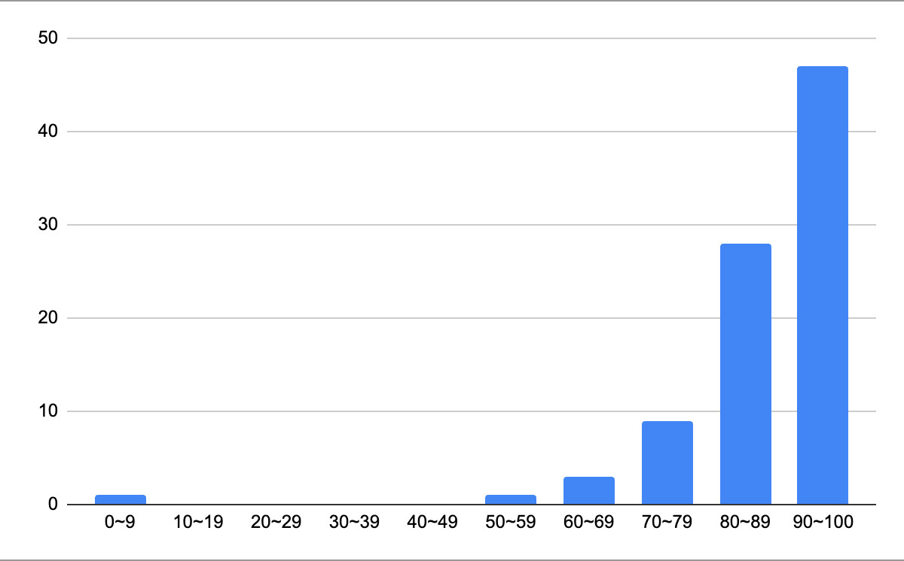

## Operating System

- Course Name: Operating System
- Permanent Course ID: CSIC30015
- Instructor: Prof. Chun-Feng Wu

### Course Content
Since I didn’t take the undergraduate OS course offered by NYCU, I’m not sure how it compares. However, it feels different from the one at NTHU. Prof. Chou’s OS course at NTHU seemed to covered each component briefly, while this one dives deeper into each topic, though not extensively due to time constraints. The instructor seems to specialize in memory systems (he offers a course called *Memory and Storage Systems* next semester), so that part was particularly detailed and clear.

<!--more-->

### Class Format
The course is conducted in English, with both online and in-person options. Recordings of the lectures, including student questions, are available. I only attended the first class and the midterm/final exams in-person, though.

### Exams and Assignments
- **20% Midterm Exam**
  - Past papers are available on NCTUPlus and Dcard. The midterm was similar to last year’s, with an additional section of true/false questions. Full marks exceeded 100.
- **30% Final Exam**
  - No review session, and the exam papers were not returned. The final covered topics from the midterm, so review thoroughly.
- **20% Paper Presentation**
  - This year, due to class size, presentations were in pairs, with each lasting 12–15 minutes. Papers had to be selected from conferences like USENIX OSDI, USENIX ATC, USENIX FAST, SOSP, ASPLOS, HPCA, ACM SC, ISCA, MICRO, and EuroSys, or other Rank A papers of 10+ pages.
  - Presenting in Week 2 or Week 3 earned bonus points (2 and 1, respectively). English presentations also gained 2 bonus points.
- **30% Homework**
  - **Assignment 1:** Modify Linux's `uname` and implement a simple system call (requires a virtual machine).
  - **Assignment 2:** Implement different scheduling policies using pthread.
  - **Assignment 3:** Write a kernel module to print system information.
- **10% Class Participation (1 question = 2 points)**

### Additional Notes
Attendance is not mandatory, and questions can be asked online.

### Final Thoughts
The instructor’s English is excellent, and even at double speed, it’s comprehensible. He’s good at explaining and clarifying doubts, revisiting them in the next class if needed. Due to the bonus system, many students actively asked questions. The grading curve was generous, with an average of 86.85 and several students scoring over 100.

---

## Institutional System Development and Management I

- Course Name: Institutional System Development and Management
- Permanent Course ID: CSIC30060
- Instructor: Prof. Chang-Chieh Cheng

### Course Content
Students present progress updates and give reports. Occasionally, there are guest lectures, and students can suggest topics to Sophi (the PM).

### Class Format
Weekly presentations by one or two students, followed by progress updates from everyone. Prof. Cheng provides suggestions but does not enforce anything. Issues related to teamwork can also be raised and addressed to Sophi. The course usually ends at about 2:30 PM.

### Exams and Assignments
No exams. Grades are based on the semester’s development progress, and an A+ is likely if you stay on track.

### Additional Notes
Absences are allowed but shouldn’t be excessive.

### Final Thoughts
This course offers rare group time for 戊組 students. Both the instructor and Sophi are approachable and helpful.

---

## Seminars

- Course Name: Seminars
- Permanent Course ID: CSIC30115
- Instructor: Various speakers each week

### Course Content
Weekly guest lectures.

### Class Format
Lectures typically last an hour. Topics can be unrelated to CS, like relationships. Most lectures are promotional talks from companies.

### Exams and Assignments
Handwrite a 100-word reflection. No submission counts as absence. The TA keeps track of attendance and checks word count rigorously.

### Additional Notes
You’re allowed three absences.

### Final Thoughts
The quality of speakers could improve. Notable ones include Microsoft and an international university.

---

## Wireless Multimedia Networks

- Course Name: Wireless Multimedia Networks
- Permanent Course ID: CSIC30073
- Instructor: Prof. Hsi-Lu Chao

### Course Content
- Quality of Service (QoS)
- Inserve
- DiffServ
- MPLS
- Internet Traffic Engineering
- IGMP & Multicasting
- MIMO Beamforming
- Dynamic Reuse of Unlicensed Spectrum
- TSN

### Class Format
Slides and board drawings. Initially no recordings, but mid-semester recordings were uploaded upon request. The instructor expects student interaction, though most students were passive. Instructor shares her research experience and insights, which can feel her passion for the subject.

### Exams and Assignments
- **Midterm (30%)**: Includes Q&A and multiple-choice. Past papers available upon request.
- **Final (35%)**: Similar to the midterm.
- **Project (35%)**: Group or individual, with a proposal presentation and a final online report.

### Additional Notes
Attendance is advised as the material is challenging to self-study.

### Final Thoughts
The instructor is passionate and explains concepts clearly. Office hours are helpful for clarifying doubts.

---

## Network Security

- Course Name: Network Security
- Permanent Course ID: CSIC30093
- Instructor: Prof. Shuh-Ping Hsieh

### Course Content
Based on *Network Security Essentials* by William Stallings.

### Class Format
Slides with verbal explanations.

### Exams and Assignments
- **Midterm (30% ± 10%)**: Covers the first six chapters. Past papers are available.
- **Final (30% ± 10%)**: Similar to the midterm.
- **Project + Homework + Quizzes (40% ± 20%)**: Projects involve recreating CVEs.

### Additional Notes
Pop quizzes are unannounced. Attendance is optional but beneficial.

### Final Thoughts
Easy A+. Attend classes for a better grasp of the material.

---

## Software Defined Networks and Network Function Virtualization

- Course Name: Software Defined Networks and Network Function Virtualization
- Permanent Course ID: CSIC30127
- Instructor: Prof. Chien-Chao Tseng

### Course Content
I didn't attend in-person classes, so I can't provide detailed information.

### Class Format
Slides with verbal explanations.

### Exams and Assignments
- Biweekly labs with demos and a final project tying everything together.
- Labs
	1. Environment Setup and Basic Operation (5%)
	2. OpenFlow Protocol Observation and Flow Rule Installation (10%)
	3. SDN-enabled Learning Bridge (15%)
	4. Unicast DHCP Application (15%)
	5. Proxy ARP (15%)
	6. Network Function Virtualization (15%)
- Final Project: (25%)
	- Virtual Routers

### Additional Notes
Attendance is optional. Completing assignments is key.

### Final Thoughts
The course is hands-on and practical, with a focus on labs and projects.