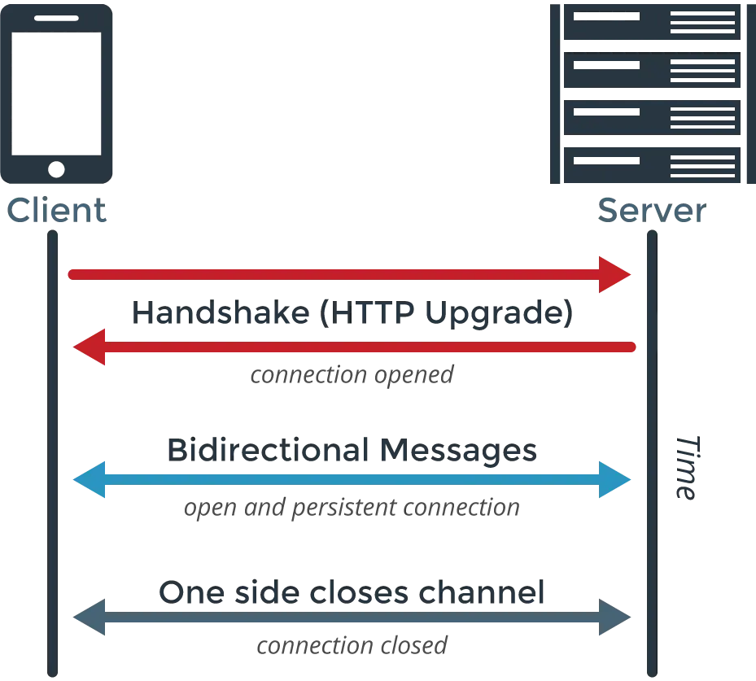

Internet communication can be divided into two main types of APIs:

- Web Service APIs (e.g. SOAP, JSON-RPC, XML-RPC, REST)
- Web Socket APIs

<!--more-->

## HTTP

[HTTP/2: the difference between HTTP/1.1, benefits and how to use it](https://factoryhr.medium.com/http-2-the-difference-between-http-1-1-benefits-and-how-to-use-it-38094fa0e95b)

### REST (REpresentational State Transfer)

→ Establishes rules for HTTP.

- GET → Retrieve data
- PUT → Modify data
- POST → Add data
- DELETE → Delete data

<!--more-->

### HTTP Polling

This can be imagined as a rabbit (Client) and a shopkeeper (Server).

#### HTTP Short Polling

Requires constant querying. The rabbit keeps asking, "Do you have carrots?" every so often. The shopkeeper responds with "No" or "Yes" each time. The sequence looks like this:

```
00:00:00 Rabbit -> Do you have carrots?
00:00:01 Shopkeeper -> No.
00:00:03 Rabbit -> Do you have carrots?
00:00:04 Shopkeeper -> No.
00:00:06 Rabbit -> Do you have carrots?
00:00:07 Shopkeeper -> Yes, here you go.
00:00:09 Rabbit -> Do you have carrots?
```

This method minimizes resource usage for both Client and Server but doesn't provide real-time data. It also wastes network resources during the back-and-forth without guaranteed results.

#### HTTP Long Polling

The shopkeeper waits until they have carrots to notify the rabbit, but if it takes too long, they eventually respond with "No." The sequence is:

```
00:00:00 Rabbit -> Do you have carrots?
00:00:10 Shopkeeper -> No.
00:00:10 Rabbit -> Do you have carrots?
00:00:13 Shopkeeper -> Yes, here you go.
00:00:13 Rabbit -> Do you have carrots?
```

This method delays both the shopkeeper and the rabbit, making them wait for each other’s response. While it eliminates latency, it's inefficient for frequent updates.

### HTTP Streaming

Here, the rabbit decides to stay and wait. The shopkeeper updates the rabbit whenever something happens:

```
00:00:00 Rabbit -> Do you have carrots?
00:00:01 Shopkeeper -> Wait a moment.
00:00:02 Shopkeeper -> Carrots are coming soon.
00:00:03 Shopkeeper -> Yes, here you go.
00:00:03 Shopkeeper -> Waiting for the next delivery.
00:00:04 Shopkeeper -> Carrots are coming soon.
00:00:05 Shopkeeper -> Yes, here you go.
00:00:05 Shopkeeper -> Waiting for the next delivery.
00:00:06 Rabbit -> That's enough, thanks.
```

This method might face delays due to proxy servers or firewalls buffering data.

#### SSE (Server Sent Events / EventSource)

This is similar to HTTP Streaming, but the rabbit asks the shopkeeper to notify them only when there are carrots:

```
00:00:00 Rabbit -> Do you have carrots?
00:00:03 Shopkeeper -> Yes, here you go.
00:00:05 Shopkeeper -> Yes, here you go.
00:00:06 Rabbit -> That's enough, thanks.
```

Both methods share a common issue noted by MDN:

> When connections are not via HTTP/2, SSE is limited by the maximum number of concurrent connections, especially when multiple tabs are open. Each browser has its limit, which is usually low (e.g., 6).

Using HTTP/2 solves this, but not all [browsers](https://caniuse.com/eventsource) support SSE.

### WebSockets

Over time, the rabbit and the shopkeeper become friends and freely communicate:

```
00:00:00 Rabbit -> Do you have carrots?
00:00:01 Shopkeeper -> Wait a moment.
00:00:01 Rabbit -> Okay.
00:00:03 Shopkeeper -> Yes, here you go.
00:00:03 Shopkeeper -> Waiting for the next delivery.
00:00:04 Rabbit -> What's the flavor?
00:00:04 Shopkeeper -> Not sure, maybe carrot flavor?
00:00:05 Shopkeeper -> Carrots are coming soon.
00:00:05 Rabbit -> Great, these are delicious!
00:00:06 Rabbit -> I've had enough, thanks.
```

Initially, they still use HTTP to establish a connection:



The Client sends a request to upgrade to WebSocket along with its key:

```
GET /chat HTTP/1.1
Host: example.com:8000
Upgrade: websocket
Connection: Upgrade
Sec-WebSocket-Key: dGhlIHNhbXBsZSBub25jZQ==
Sec-WebSocket-Version: 13
```

If the Server agrees, it responds:

```
HTTP/1.1 101 Switching Protocols
Upgrade: websocket
Connection: Upgrade
Sec-WebSocket-Accept: s3pPLMBiTxaQ9kYGzzhZRbK+xOo=
```

Since WebSocket uses a different communication protocol, it doesn't occupy the HTTP channel.

### References
