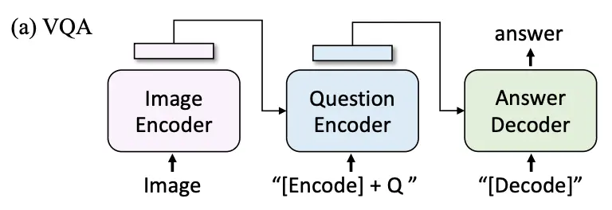

PyTorch Neuron works similarly to TorchScript’s Tracing [\[1\]](#references), as it compiles your model based on provided input and output example to accelerate inference/training time. One trade-off of this approach is that the input and output dimensions become fixed to the dimensions of the example you provide during compilation.

Unlike TorchScript, PyTorch Neuron can only run on NeuronChips, which are provided by AWS. However, the compilation process can still be performed on any machine with CPUs.

In this tutorial, we will focus on compiling and hosting models on Inf2 machines, specifically on the Inf2.xlarge instance type.

Now, let's walk through how it works.

## Compiling Basic Model

Compiling a basic model is quite simple. [Here](https://awsdocs-neuron.readthedocs-hosted.com/en/latest/src/examples/pytorch/torch-neuronx/resnet50-inference-on-trn1-tutorial.html) is an example of how to compile and comparing the performance between different batch size.

## Compiling [`BlipForQuestionAnswering`](https://huggingface.co/docs/transformers/model_doc/blip#transformers.BlipForQuestionAnswering)

Now, we have a more complex task: compiling a Seq2Seq model. We’re using BlipForQuestionAnswering as an example.

### Issues

For starters, if you try to compile a Seq2Seq model the same way you compiled a standard ML model before, it will only be able to handle fixed-size input and output. Fixed-size input might be acceptable if you resize the image and always ask the same question. However, fixed-size output can be problematic, as the sentence might suddenly stop before it is complete. So, we need to dive deeper to make the model work.

### Idea

In [the BLIP paper](https://arxiv.org/abs/2201.12086), the structure of a VQA model consists of three components: an Image Encoder, a Question Encoder, and an Answer Decoder.

If you read the [source code](https://github.com/huggingface/transformers/blob/v4.50.0/src/transformers/models/blip/modeling_blip.py#L1240-L1247) of BlipForQuestionAnswering, you can see that it also has three models in the class: vision_model, text_encoder and text_decoder.

In the [generate function](https://github.com/huggingface/transformers/blob/0b057e66b52556da3a1cbc29e2a98c0784ea9c33/src/transformers/models/blip/modeling_blip.py#L1377), the `vision_model` first encodes the image, then the `text_encoder` encode both question and the output of `vision_model` and finally, use `text_decoder`’s generate function produces answer. If you are not familiar with how a transformer works, [here](https://youtu.be/N6aRv06iv2g?si=BoPIYH6mkoQezzFx) is a great video in Chinese that explains it.



So, what we have to do is replace the three models with compiled neuron models, ensuring that the most time-consuming jobs is still handled by the neuron chip. We can use the comment [here](https://github.com/aws-neuron/aws-neuron-sdk/issues/672#issuecomment-1540781448) as an example of how to wrap these models so that they can be compiled.

### Implementation

#### Text encoder

Let's take a first look at `text_encoder`. One of the challenges of compiling a neuron model is passing parameters into the model. Specifically, you can't assign what parameter it is. For example, you can't use `foo(input_ids=input_ids, attention_mask=attention_mask)`. Instead, it can only be passed like `foo(input_ids, attention_mask)`. 

To address this, we need a wrapper to arrange the parameters. The following code wrap the original model into a `NeuronTextEncoder` class, which serves this purpose. We will then use `TextEncoderWrapper` as a normal `text_encoder` model, which you'll see when we reassemble the models.

```python
class NeuronTextEncoder(torch.nn.Module):
    def __init__(self, model):
        super().__init__()
        self.model = model

    def forward(self, input_ids, attention_mask, encoder_hidden_states, encoder_attention_mask):
        output = self.model(
            input_ids=input_ids,
            attention_mask=attention_mask,
            encoder_hidden_states=encoder_hidden_states,
            encoder_attention_mask=encoder_attention_mask,
            return_dict=False,
        )

        return output[0]

class TextEncoderWrapper(torch.nn.Module):
    def __init__(self, model):
        super().__init__()
        self.model = NeuronTextEncoder(model)

    @classmethod
    def from_model(cls, model):
        wrapper = cls(model)
        wrapper.model = model

        return wrapper

    def forward(self, input_ids, attention_mask, encoder_hidden_states, encoder_attention_mask, return_dict):
        output = self.model(input_ids, attention_mask, encoder_hidden_states, encoder_attention_mask)
        return (output, )
```

#### Vision Model

The vision model is similar to the text encoder since both are encoders. However, a key difference is that the original vision model returns a `BaseModelOutputWithPooling` object. However, the neuron model cannot achieve this. Therefore, in the `VisionModelWrapper`, we need to collect the output of the compiled neuron model and return it with the corresponding object.

```python
class NeuronVisonModel(torch.nn.Module):
    def __init__(self, model):
        super().__init__()
        self.model = model

    def forward(self, pixel_values):
        return self.model(pixel_values=pixel_values, interpolate_pos_encoding=False)

class VisionModelWrapper(torch.nn.Module):
    def __init__(self, model):
        super().__init__()
        self.model = NeuronVisonModel(model)

    @classmethod
    def from_model(cls, model):
        wrapper = cls(model)
        wrapper.model = model

        return wrapper

    def forward(self, pixel_values, interpolate_pos_encoding):
        output = self.model(pixel_values)

        return BaseModelOutputWithPooling(
            last_hidden_state=output['last_hidden_state'],
            pooler_output=output['pooler_output'],
        )
```

So far the structure of these two models looks like this. What we will be compiling are `NeuronTextEncode` and `NeuronVisionModel`. And the final BLIP model will be using `TextEncoderWrapper` and `VisionModelWrapper` as the model to call.


#### Text Decoder

Now, that's dealt with the most troubling part: the decoder. In the encoder part, we can control the input size by padding during the processor phase, so no padding is needed in the model. However, the text decoder's mechanism requires us to pad the input every time before sending it into the model.

The DecoderPaddedGenerator class requires a `prepare_inputs_for_generation` function. This function is called before passing inputs to the decoder. It is responsible for padding the input to a fixed size. Additionally, it needs to handle the attention mask, ensuring the model focuses only on non-padded parts. The `forward` function is rather simple in this class, just need to order the input and pass down to next layer.

```python
class DecoderPaddedGenerator(PreTrainedModel, GenerationMixin):

    @classmethod
    def from_model(cls, model):
        generator = cls(model.config)
        generator.decoder = DecoderOutputFormatter(PaddedDecoder(model))

        return generator

    @classmethod
    def from_pretrained(cls, directory):
        config = AutoConfig.from_pretrained(directory)
        obj = cls(config)
        obj.decoder = DecoderOutputFormatter(torch.jit.load(os.path.join(directory, "text_decoder.pt")))


        return obj
    
    @property
    def device(self):  # Attribute required by beam search
        return torch.device('cpu')

    def prepare_inputs_for_generation(
        self,
        input_ids,
        encoder_hidden_states=None,
        encoder_attention_mask=None,
        **kwargs,
    ):
        current_length = input_ids.shape[-1]
        pad_token_id = self.config.pad_token_id
        pad_size = self.config.max_length - current_length
        input_ids = F.pad(input_ids, (0, pad_size), value=pad_token_id)

        attention_mask = torch.ones_like(input_ids)
        attention_mask[:, current_length:] = 0

        return dict(
            input_ids=input_ids,
            encoder_hidden_states=encoder_hidden_states,
            encoder_attention_mask=encoder_attention_mask,
            attention_mask=attention_mask,
            current_length=torch.tensor([current_length - 1]),
        )
            

    def forward(
            self,
            input_ids, 
            encoder_hidden_states=None, 
            encoder_attention_mask=None,
            attention_mask=None,
            current_length=None,
            **kwargs
        ):

        return self.decoder(
            input_ids,
            encoder_hidden_states,
            encoder_attention_mask,
            attention_mask,
            current_length,
        )
```

`DecoderOutputFormatter` and `VisionModelWrapper` serve similar purposes: they order the input and format the output into the required structure.

`PaddedDecoder` has two key responsibilities: ordering the input and cleaning the return data. The decoder originally returns all previous outputs, but we only need the latest result. To achieve this, we use `torch.take_along_dim` to remove the previous outputs.

```python
class PaddedDecoder(torch.nn.Module):
    def __init__(self, model):
        super().__init__()
        self.decoder = model

    def forward(
            self,
            input_ids, 
            encoder_hidden_states=None, 
            encoder_attention_mask=None,
            attention_mask=None,
            current_length=None,
            **kwargs
        ):

        output = self.decoder(
            input_ids=input_ids,
            encoder_hidden_states=encoder_hidden_states,
            encoder_attention_mask=encoder_attention_mask,
            attention_mask=attention_mask,
            use_cache=False,
        )
        result = torch.take_along_dim(output['logits'], current_length.view(1, -1, 1), dim=1)

        return result

class DecoderOutputFormatter(torch.nn.Module):
    def __init__(self, decoder):
        super().__init__()
        self.decoder = decoder

    def forward(
            self, 
            input_ids,
            encoder_hidden_states=None,
            encoder_attention_mask=None,
            attention_mask=None,
            current_length=None,
            **kwargs
        ):
        logits = self.decoder(
            input_ids,
            encoder_hidden_states,
            encoder_attention_mask,
            attention_mask,
            current_length,
            **kwargs
        )

        return CausalLMOutputWithCrossAttentions(
            logits=logits,
        )


```


#### Combine all the models

We need to integrate the three models into a `BlipForQuestionAnswering` object.

```python
class NeuronBlipForQuestionAnswering(BlipForQuestionAnswering):
    def __init__(self, config):
        super().__init__(config)
    
    @classmethod
    def from_pretrained(cls, directory, num_models):
        config = AutoConfig.from_pretrained(directory)

        models = []
        for i in range(num_models):
            models.append(cls(config))
        
        for i in range(num_models):
            models[i].vision_model = VisionModelWrapper.from_model(torch.jit.load(os.path.join(directory, 'vision_model.pt')))
        
        for i in range(num_models):
            models[i].text_decoder = DecoderPaddedGenerator.from_pretrained(directory)
        
        for i in range(num_models):
            models[i].text_encoder = TextEncoderWrapper.from_model(torch.jit.load(os.path.join(directory, 'text_encoder.pt')))

        return models
```

### Tracing

We can now start compiling the models.

```python
def trace(model, directory, compiler_args=f"--auto-cast-type fp16 --logfile {LOG_DIR}/log-neuron-cc.txt"):
    if os.path.isfile(directory):
        print(f"Provided path ({directory}) should be a directory, not a file")
        return

    os.makedirs(directory, exist_ok=True)
    os.makedirs(LOG_DIR, exist_ok=True)

    # skip trace if the model is already traced
    if not os.path.isfile(os.path.join(directory, 'text_decoder.pt')):
        print("Tracing text_decoder")
        inputs = (
            torch.ones((1, 20), dtype=torch.int64),
            torch.ones((1, 8, 768), dtype=torch.float32),
            torch.ones((1, 8), dtype=torch.int64),
            torch.ones((1, 20), dtype=torch.int64),
            torch.tensor([3]),
        )

        decoder = torch_neuronx.trace(model.text_decoder.decoder.decoder, inputs, compiler_args=compiler_args)
        torch.jit.save(decoder, os.path.join(directory, 'text_decoder.pt'))
    else:
        print('Skipping text_decoder.pt')

    if not os.path.isfile(os.path.join(directory, 'vision_model.pt')):
        print("Tracing vision_model")
        inputs = (
            torch.ones((1, 3, 384, 384), dtype=torch.float32)
        )

        vision = torch_neuronx.trace(model.vision_model.model, inputs, compiler_args=compiler_args)
        torch.jit.save(vision, os.path.join(directory, 'vision_model.pt'))
    else:
        print('Skipping vision_model.pt')

    if not os.path.isfile(os.path.join(directory, 'text_encoder.pt')):
        print("Tracing text_encoder")
        inputs = (
            torch.ones((1, 8), dtype=torch.int64),
            torch.ones((1, 8), dtype=torch.int64),
            torch.ones((1, 577, 768), dtype=torch.float32),
            torch.ones((1, 577), dtype=torch.int64),
        )

        encoder = torch_neuronx.trace(model.text_encoder.model, inputs, compiler_args=compiler_args)
        torch.jit.save(encoder, os.path.join(directory, 'text_encoder.pt'))
    else:
        print('Skipping text_encoder.pt')

    traced_model = NeuronBlipForQuestionAnswering.from_pretrained(directory, 1)[0]

    return traced_model

```

### Inference

When inferencing, remember to pad the input to the max_length you set. [Here's](https://github.com/ARui-tw/tech-blog/blob/master/content/en/posts/inf2Compiling/code/example.ipynb) a full example of compiling and verifying the result.

```python
def infer(model, processor, text, image):
    # Truncate and pad the max length to ensure that the token size is compatible with fixed-sized encoder (Not necessary for pure CPU execution)
    input =  processor(image, text, max_length=max_decoder_length, truncation=True, padding='max_length', return_tensors="pt")
    output = model.generate(**input, max_length=max_decoder_length)
    results = processor.decode(output[0], skip_special_tokens=True)
    print(results)
```

## References

\[1\] [Good Source for understanding TorchScript’s Tracing and Scripting](https://ppwwyyxx.com/blog/2022/TorchScript-Tracing-vs-Scripting)