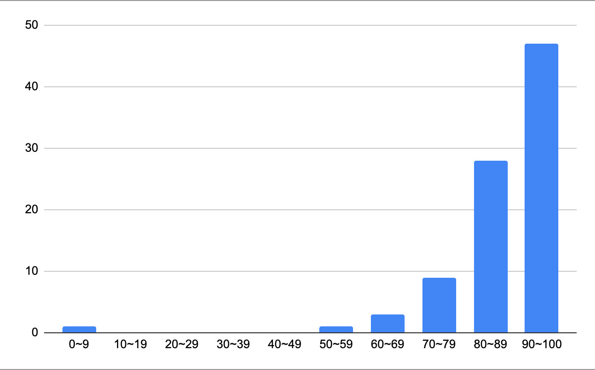

## 作業系統

- 英文課名：Operating System
- 永久課號：CSIC30015
- 教師：吳俊峯

<!--more-->

### 課程內容
因為沒上過交大這邊教的大學部 OS，所以不知道跟大學的差別有多少。但是體感上跟清大差不少。清大周志遠教授的 OS 感覺比較想是每個 component 都碰一下，但是這堂比較偏向每個都會教到比較深層的。但可能時間的關係，所以也沒有辦法教很多很深。老師好像是作記憶體的（他下學期還有開一門〈記憶體與儲存系統〉），所以那段講的特別細節和清楚。

### 上課方式
    
英文授課。線上實體並行，會有影片存檔。課間的學生提問都會被錄下來。基本上我除了第一堂和期中期末以外都沒去過了 XDD
    
### 考試作業
- 20% Midterm Exam
	- 有人在 nctuplus 上面丟考古了，Dcard 也有一個篇在討論這個。基本上跟去年考古一樣，多了一個 section 的是非題。滿分依舊破百。
- 30% Final Exam
	- 沒檢討，考卷沒發回來。會考到期中範圍，記得複習。
- 20% Paper Presentation
	- 這年因為人數的關係兩個人一組。一組約 12~15 分鐘報一篇。要從老師指定的 conferences 中選（USENIX OSDI, USENIX ATC, USENIX FAST, SOSP, ASPLOS, HPCA, ACM SC, ISCA, MICRO, EuroSys）。或是 Rank A 且十頁以上的。
	- 第二週報加兩分，第三周報加一分。用英文報加兩分。
- 30% Homework
	- 作業一
		- 要改 Linux 的 uname，需要一台虛擬機。然後實作一個簡單的 system calls。
	- 作業二
		- 用 pthread 去作不同 policy 的 scheduling。
	- 作業三
		- 寫一個 kernel module 去印出系統資料。
- 10% Class Participation (1 question 2pts)

### 其他
不點名。線上也可以發問。
    
### 最後想說的話
    
老師的英文很好，用近乎兩倍速也可以聽懂。解釋能力也很好，闡述都很清楚。學生問問題如果遇到他不會他也會在下次補充。可能因為有加分的關係，所以很多人在問問題。最後還有小調三分，佛！
    
班平均 86.85，還有不少人破百 @@
    

## 校務系統開發與管理（一）

- 英文課名：Institutional System Development and Management
- 永久課號：CSIC30060
- 教師：鄭昌杰（雖然上面寫很多人，但是基本上是鄭老師在帶。）

### 課程內容
    
學生上台報告和報進度。有時候會安排演講，可以跟 Sophi（我們的 PM）許願。
    
### 上課方式
    
每週會排一到兩個人上台報告。之後就是報大家這周各自的進度，老師會給你一些參考意見，但真的只是參考，他也不會強迫你作什麼。如果有遇到「人際」問題也可以在這時候提出來，人很好的 Sophi 會幫你解決。基本上老師也想趕快閃人（大家都想），所以都會在 2:30 分左右結束課程。
    
### 考試作業
    
無。評分由老師評估你這學期的開發進度。基本上不要亂搞應該都會 A+
    
### 其他
    
可以請假，但是不要太誇張。
    
### 最後想說的話
    
戊組人們少數聚在一起的時間（？）。老師和 Sophi 人都很好，有問題都可以提出來。
    

## 論文研討

- 英文課名：Seminars
- 永久課號：CSIC30115
- 教師：每週都有不同的講者

### 課程內容
    
聽演講。
    
### 上課方式

每週會要請講者去演講。通常是一個小時會結束。有時候會出現跟 CS 毫無關係的演講主題，像是兩性關係（超ㄏ）。多數都是企業來宣傳。
    
### 考試作業
    
手寫 100 字心得。沒寫算沒到。助教會每週更新目前大家的出席次數。聽說會真的數字數，有人在 Dcard 抱怨他被抓到。
    
### 其他
    
可以三次不出席。
    
### 最後想說的話
    
真心希望他們可以邀請更有料的講者 = =。有記得好的應該是一次是微軟的和另一個國外大學來講。
    

## 無線多媒體網路

- 英文課名：Wireless Multimedia Networks
- 永久課號：CSIC30073
- 教師：趙禧綠

### 課程內容
- Quality of Service (QoS)
- Inserve
- DiffServ
- MPLS
- Internet Traffic Engineering
- IGMP & Multicasting
- MIMO Beamforming
- Dynamic Reuse of Unlicensed Spectrum
- TSN

### 上課方式
    
投影片加上板書作畫。一開始沒有錄影，期中後經學生要求有錄影上傳。上課老師會想要學生的反應，但是我們這屆沒什麼反應，所以坐第一排的同學就可以一直跟老師對話 XD。老師時不時會分享他實驗室的東西和他之前的經驗，可以感受到他對於這個領域的熱情。
    
### 考試作業
- Midterm: 30%
	- 考題有問答和選擇。可以跟老師要去年考古，但是不會給解答。可以跟老師 argue 範圍 XDD
- Final: 35%
	- 類似期中考。但是老師忘記給考古了 QQ
- Project: 35%
	- 可以一到二人，但是兩個人的要做的比一個人的難。題目自訂，老師是說拿課堂內教過的，但好像很多人拿其他課或實驗室在做的東西來延伸？期末考前有一次 Proposal 報告，老師會給意見和評價難度。期末後的報告是線上報告，這年是另外約時間。
	
### 其他

不點名，但是強烈建議到課。自己啃講義或是原文書很痛苦……

### 最後想說的話

老師會把 5G 念成「五雞」，把 Wi-Fi 念成「歪ㄈㄞ」。

老師的解釋都很清楚，但是小生駑鈍，很多之前學過的東西都忘記了。下課可以去找老師一直問到懂為止。有時候太多人問一樣的問題老師會叫已經問過的同學講給剛來的同學。可能因為小班的關係，老師都很 free，想要什麼都可以問問看。

最後成績看不到細項，但是拿 A+ 就沒有去跟老師問成績了 XD
    

## 網路安全

- 英文課名：Network Security
- 永久課號：CSIC30093
- 教師：謝續平

### 課程內容
基本上就是照著《William Stallings, Network Security Essentials – Applications and Standards, Pearson》的各個章節。
    
### 上課方式
    
投影片加上口述補充。
    
### 考試作業
    
老師說會在根據當年的成績調整分配。
    
- Midterm Exam: 30% ± 10%
	- 考前六章，交大資工考古題系統上面有考古。有一定的題數會和前幾年的重複。建議可以多刷幾年。
- Final Exam: 30% ± 10%
	- 大致跟期中考一樣。
- Project + Homeworks + quizzes: 40% +- 20%
	- Project 是從助教給的 CVE 中挑一個出來重現，建議早點開始挑個簡單的來寫。報告要分三次交，每次會有不同的進度。基本上分數很好拿，全班平均超高。
        
### 其他
不點名，沒線上，沒錄影。會有 pop quiz。這學期遇到兩次。
    
### 最後想說的話
甜爛。建議去上課，拿原文書啃很花時間，但是可以學到比較多東西。

    

## 軟體定義網路及網路功能虛擬化

- 英文課名：Software Defined Networks and Network Function Virtualization
- 永久課號：CSIC30127
- 教師：曾建超（超哥）

###  課程內容
沒…沒在上課 Orz
    
### 上課方式
投影片加上口述補充。
    
### 考試作業
- 大概每兩週一個 Lab，deadline 的下一周要去實體 Demo。週而復始直到寫完 Final Project :)
- Labs
	1. Environment Setup and Basic Operation (5%)
	2. OpenFlow Protocol Observation and Flow Rule Installation (10%)
	3. SDN-enabled Learning Bridge (15%)
	4. Unicast DHCP Application (15%)
	5. Proxy ARP (15%)
	6. Network Function Virtualization (15%)
- Final Project: (25%)
	- Virtual Routers
	- 基本上就是把前面的東西串起來

### 其他
不點名，有線上，有錄影。因為沒考試，所以只要可以把功課寫出來，不上課也不會真的出大事（？
    
### 最後想說的話
希望超哥不會看到我沒上課 QQ