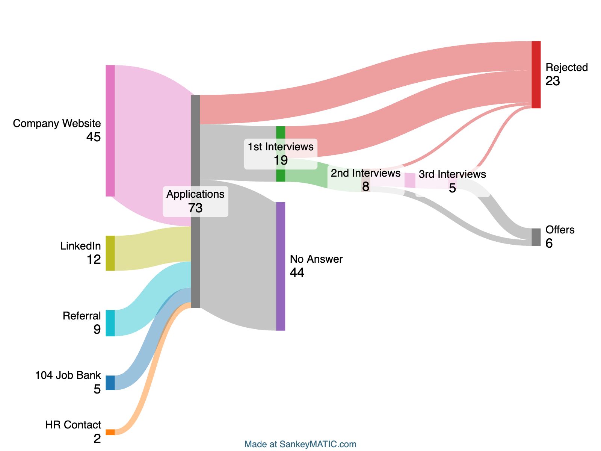

## TL;DR

我覺得如果要總結面試的經驗，今天剛好看到的這則影片深得我心



## 背景

學歷：114 CS 學士 / 113 CS 碩士

沒有發 paper，沒有競賽成績，學士 GPA 低

碩士有去新創公司實習約一年

有修 113 的 OSC（OSDI），個人認為這堂課在找台灣的軟韌缺挺有用的，但純軟的面試可能就不會問到這麼多細節。

## 目標

這篇的時間從 2025 畢業前開始找研替到畢業後找正職都包含在內。

主要目標放在台北的缺，從一開始的純軟/DevOps，最後主要都是找 embedded 的為主。

很多時間和面試內容的細節因為過太久了有點忘記了，還請包容。如果想要知道更詳細的可以 mail 我，我再努力回想看看 XD

## 結果

投遞後沒有面試的太多了，就不一一列舉了。

Offer：TSMC、Cyberlink、MTK、Motorola Solutions、Amazon、Garmin

面試後被拒：Synology、Appier、群聯、慧榮、Kronos、Nvidia、Qualcomm、CIeNET、趨勢、Allicron

## 紀錄

### [TSMC] IT 預聘（研替）
- D+0 送出履歷
- D+4 收到面試邀約
- D+11 收到 Hackerrank（Deadline: D+25）
- D+14 主管一面

   面試內容基本上就是聊自我介紹和細節的 follow up。印象中沒有太多技術的追問。
   有詢問是否有在台北辦公室的機會，但主管也明確的說沒有。
- D+21 收到廠測通知
- D+22 完成 Hackerrank
- D+28 廠測
- D+28 資歷查核寄出
- D+32 資歷查核完成
- D+39 HR 口頭 offer
- D+47 紙本 offer

### [Synology] Product Developer
- D+0 送出履歷（內推）
- D+1 收到面試邀約
- D+21 On-site 面試兩關
   - 第一關

      兩位主考官。問了履歷、OS 基本概念、C++ OOP 的語法、考了一題 Leetcode easy。
      可以看出他們做了很詳細的準備，履歷上面也被畫滿了筆記。還有去查 GitHub 上面之前作業的 repo，並詢問相關細節。
   - 第二關

      一位主考官。一開始比較輕鬆一點，主要也是詢問履歷內容。後面考了一題 Leetcode medium。結束後說主管臨時有會議，之後再約。

- D+29 寫信詢問，當天收到感謝信。

其實他說要之後再約面試的時候感覺應該是已經沒戲了，但是因為我 LC 算是都有些出來（雖然花了很多時間跟用了很多提示，但當時對於白板題真的沒練熟），所以我以為還會有後續。後面也有遇到原本三關變兩關的之後就知道這應該就是沒了 XD

### [Cyberlink] 人工智慧軟體應用工程師 & [Perfect] 後端工程師（研替）

兩個流程是一起走的，所以就寫一起。
- D+0 送出履歷（內推）
- D+3 收到面試邀約
- D+10 一面，一天兩個部門

   - 先寫性向測驗和英語測驗
   - 玩美移動 後端工程師

      問履歷，考一點基本的後端知識、SQL 語法、看一下 GitHub 上面的 project
   - 訊連科技 人工智慧軟體應用工程師

      問履歷而已，面過最輕鬆的一關。有詢問大學成績

- D+20 收到一面通過通知，選一邊繼續進到二面
- D+24 on-site 二面

   大主管聊天和口頭 offer

### [Nvidia] BaseOS Foundry Engineer (RDSS Intern)
- D+0 送出履歷
- D+5 收到面試邀約
- D+7 一面

   印度考官，口音不難，但是網路卡卡的。
   考 Python 的語法和觀念，還有用 Leetcode，限定用 Python 寫。

- 無聲

### [趨勢科技] Software Engineer
- D+0 送出履歷
- D+44 收到 OA
- D+73 實體一面

   有兩個 team 個別面試。
   第一個 team 考了一些 python 的語法和簡單的 leetcode。還考了一題類似 System Design 的題目，但感覺其實比較像是 OOP 的設計。總共兩個考官。
   第二的 team 就非常著重在履歷的細節和一些 BQ 上。總共三個考官。
   結束後 HR 會來詢問志願。

- D+93 實體二面

   只有面一面的第一個 team。先是自我介紹和 follow up，接著考了一題 LRU。有解出來被面試官稱讚很少人可以解出來（？

   結束後 HR 馬上進來約隔天面試。

- D+94 HR 面

   主要是 BQ，和一些消息打聽。這關我大意了，回答得很隨便，薪水也開太高了。後續被刷掉也算是預料之內了。經過這次之後不管面哪間的哪關我都是誠意十足的回答問題…

- D+102 感謝信

### [Appier] Software Engineer, Backend Development (Graduate)

這個不知道算不算有面試，但還是姑且寫一下。我只有經歷了一關 HR 的詢問意願和說明可能會面試到的 team，後續就直接無聲了 XD

### [Nvidia] System Software Engineer, GPU - New College Graduate
- D+0 投履歷
- D+8 收到 OA
- D+14 完成 OA
- D+27 寄信問 HR，HR 說 “decide to not proceed your application further”
- D+29 收到一面邀約
- D+34 一面

   三個考官車輪戰，但我忘記細節了 Orz。印象中有考了 C 的實作（挖空考）、經歷的詢問、Leetcode LRU。

- 無聲

### [群聯] 軟體工程師
- D+0 投遞
- D+1 收到面邀
- D+26 一面

   考很傳統的那種 C 語法和陷阱。還有自我介紹和 follow up。雖然只有一個考官和後面加入的主管，但是扎扎實實的面了兩個半小時。

- 感謝信

### [群聯] PCIe SSD 韌體開發工程師
- D+0 投遞
- D+1 收到面邀
- D+7 一面

   也是考 C 語法和陷阱。

- D+15 感謝信

### [CleNET] ML/Python Engineer
- D+0 HR 聯繫並投遞履歷
- D+9 一面

   要先寫 Python 的考卷，不會檢討。接下來會先用英文對談來確認英文能力。然後就是自我介紹跟 follow up 的技術問題。兩個面試官，一個應該是主管，另一位會問比較詳細的技術問題。

- 無聲

### [慧榮] SSD韌體工程師
- D+0 投遞
- D+8 一面

   會先寫一份考題，然後會有兩個 team 分別面試。接著 HR 會進來確認志願序跟其他細節。

   考題基本上幾乎都是 0x10 出來的，幾乎一模一樣。（我當初去面的時候還沒準備到那邊，後來看才發現只要有看過那篇文章就一定都會寫）

   面試內容大多都還是以自我介紹和 follow up 為主。

### [Allicorn] 軟體工程師
- D+0 投遞
- D+6 一面

   基本上是自我介紹和一些技術能力的確認。第一次面小型的新創，感覺很多問題回答得很不好。

- D+22 二面

   沒有技術問題了，比較像是觀念價值觀有沒有符合他們想要的人。

- 無聲

### [MTK] 遊戲性能分析與優化軟體資深工程師/技術副理 (台北)

寫著資深工程師，但還是會抓 new grad 來面試。面試的時候問主管他說其實都是這樣，所以看到缺不用管年資就都丟丟看也不虧 XD
- D+0 投遞
- D+41 一面邀約

   面試前需要先寫一份「 C語言線上測驗」。

- D+53 一面

   十分詳細的 OS 問題。主管感覺是十分有料的，問問題基本上是隨口問都很有內容。之後我在詢問職缺細節的時候說明的也很清楚。

- D+61 二面

   比較像是閒聊？但因為我大學有 ML 的專題，所以內容幾乎都在討論說他們的一個問題是否可以用 RL 來解決。雖然相談甚歡，但是我不是要面 ML 缺的啊…

- D+69 HR 面
- D+80 口頭 offer 說明

### [Motorola Solutions] Graduate System Engineer
- D+0 投遞
- D+18 一面
- D+26 HR 面
- D+33 口頭 Offer

這個面試我真的不知道在問什麼，幾乎都不是我的技能樹點到的，很多名詞甚至是我沒聽過的 QQ

這應該是類似網管的缺？是真的很硬體的那種網路設備。

### [Garmin] Embedded Fitness
- D+0 投遞
- D+37 一面

   一面會先是 HR 跟你聊聊天。應該就算是 HR 面了，之後就不會有面 HR 的環節了，挺特別的。接著是兩位面試官一起面，基本上是自我介紹和 follow up，感覺相較其他面試，技術的問題沒那麼多。

- D+54 實體二面

   二面會進到公司去面試，面試我的是未來的主管。HR 和主管有說如果是中午面試的話，可以和團隊一起吃午餐，可以更熟悉團隊成員。面試內容基本上是介紹專案和 follow up，會有幾題情境題來讓你發揮想解法。

- D+58 口頭 Offer

### [Kronos] Software Engineer, C++
- D+0 投遞
- D+6 收到 HackerRank OA
- D+19 一面邀約
- D+26 一面

   直接開 code editor 開始寫 code。比起基本的算法，更多是如何使用 C++ 達到極致的效能（我記得因為我有用到 unordered_map，所以還有被問 hash map 要用什麼 hash function 之類的）。我之前是完全沒研究過，所以基本上面完就知道沒料了。

- D+39 感謝信

### [Qualcomm] AI Software Platform Engineer
- D+0 投遞
- D+15 一面邀約

   可能要多收集履歷，中間也剛好有卡到連假，所以預約面試的時間被推到很久以後。

- D+61 一面

   總共預約三小時。第一關順著我的專案介紹後開始進入 Jserv 老師課程考試模式。基本上就是面試官問一個問題，我思考一分鐘發現不會就瞎掰/說不知道，對方知道我不會，推薦我去看 Jserv 老師的課程。差不多被電了一個小時後就換下一位面試。

   第二位的問題就沒那麼難了，但我對於這場面試的記憶都只有第一場被電爛，所以不記得問了什麼了… 只記得也是有幾題是答不出來的。第二位結束後，告知今天的面試就到這裡，沒有第三關了。

- 無聲

面完之後只能說是信心全無。比起生氣怎麼考這麼難，更多是對過去不努力的自己的檢討，和認知到了自己不夠格拿到這份工作。但現在回頭來看，正如影片中提到的，其實在這個時間點質疑自己不夠強早已來不及了。比起自卑或難過，投遞/準備下一個面試才是我們現在要做的事情。

### [Amazon] Software Dev Engineer
- D+0 投遞
- D+15 OA（C++ & Workstyle Assessment）
- D+22 一面邀約

   一樣是需要等一下，因為要收集更多履歷和卡連假

- D+47 一面

   兩題 leetcode 和一題 LP

- D+53 二三面邀約
- D+62 二面

   職缺主管面試。幾題 0x10 的題目 + 一題 leetcode + 一題 LP

- D+64 三面

   Bar raiser 面。這網路上應該很多經驗分享。基本上是他的題目會對應到某幾個 LP，然後會瘋狂追問細節，詳細到某個專案用的框架、語言、成員…

- D+77 口頭 Offer

   沒有議價空間（畢竟是 new grad 就是了）

## 心得

找工作真的很累，尤其是這過程其實有點孤單和無助。不像是學生的考試，有準備就有分數。而且面對生活成本的壓力，你知道每過一天你沒找到工作，你就損失了多少當初如果選擇 XXX 的話可以拿到的薪水（尤其是我放棄的是 TSMC IT…）。每拿到一次面邀、面試回答不好、收到 offer、決定放棄 offer… 都會讓你心情起伏，要在這個壓力下準備下一場、投遞更多可能無聲的履歷，我覺得痛苦程度不亞於碩論。（也可能是因為我碩論只產出了一坨 XD）

要說給什麼好建議嗎… 我好像也完全沒辦法。我不覺得我最終的結果是什麼經驗的累積。我曾經很崇尚 Steve Jobs 所說的「生命的每一點終將連成一線」，但其實我當初拿到 Offer 的時候，我並沒有看出來是過去的哪些點，連到了現在的這一點。大學的活動、專題，碩士的實習、論文、修課，我覺得這些大多跟我拿到的那份 Offer 無關。唯一有關的就是刷題，我最不擅長，也不喜歡的部分。

但有趣的是，在跟 Amazon HR 口頭 offer 的時候，他說當他看到我終於拿到 offer 時，他就覺得「這個 ARui 終於上岸了」。至於他為什麼會特別記得我呢，只是因為我的 email 是用自己的 domain 的。而我會開始註冊 domain、用自己的 domain 收發信，都跟大學的活動、碩士的實驗室學長有關。那要說這趟找工作苦難的終點和我過去的經歷都沒關係嗎，講起來好像又不一定了 XD （我知道 HR 可能對面試本體不會有很大的影響，但是她願意撈我上來對我來說也是幫助很大。尤其是她真的是我遇過的 HR 中最頂的 HR，沒有之一）

總之，我是想要說，找工作很辛苦，很多細節，更多挫折。但你在這途中累積的，不管是經驗也好、知識也好，我相信未來終有一天會幫到你的。至少我是這麼希望的 :P
