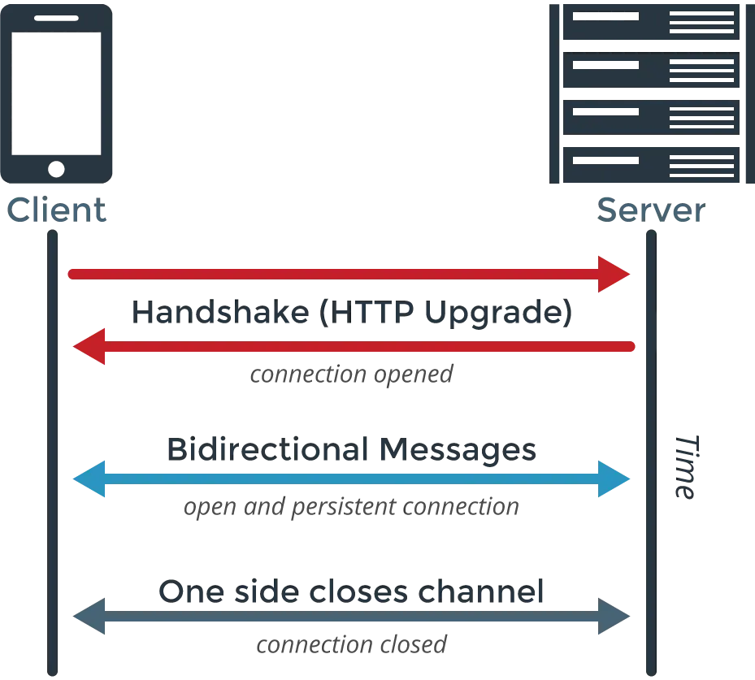

網路溝通可以分成兩種主要的 API

- Web Service APIs (e.g. SOAP, JSON-RPC, XML-RPC, REST)
- Web Socket APIs

## HTTP

[HTTP/2: the difference between HTTP/1.1, benefits and how to use it](https://factoryhr.medium.com/http-2-the-difference-between-http-1-1-benefits-and-how-to-use-it-38094fa0e95b)

### REST (REpresentational State Transfer)

→ 幫 HTTP 套規則

- GET → 取得資料
- PUT → 修改資料
- POST → 新增資料
- DELETE → 刪除資料

### HTTP polling(輪詢)

可以用兔子（Client）和店老闆（Server）來想像。

#### HTTP Short Polling

需要一直問。像是兔子一直站在店旁邊不停地問「有紅蘿蔔嗎？」，每問一次老闆就要回他一次「沒有。」或是「有。」老闆回完話後，兔子過一陣子之後就會再問一次「有紅蘿蔔嗎？」所以整個流程就會像：

```
00:00:00 兔子 -> 有紅蘿蔔嗎？
00:00:01 老闆 -> 沒有。
00:00:03 兔子 -> 有紅蘿蔔嗎？
00:00:04 老闆 -> 沒有。
00:00:06 兔子 -> 有紅蘿蔔嗎？
00:00:07 老闆 -> 有，拿去。
00:00:09 兔子 -> 有紅蘿蔔嗎？
```

這種方法雖然不會占用 Client 和 Server 過多的資源，但是因為他每過一陣子才會再重新問一次，所以也不能拿到即時的資料。還有就是在來回傳輸的過程中還是會頻繁的浪費網路資源，還有可能什麼都沒拿到。

#### HTTP Long Polling

這個方法就是老闆生氣了，不想要理兔子了，所以他決定等到貨到了再跟兔子說有紅蘿蔔了。但是如過或太久沒有到，久到他都氣消了，他還是會跟兔子說「沒有」。所以對話會變成下面這樣：

```
00:00:00 兔子 -> 有紅蘿蔔嗎？
00:00:10 老闆 -> 沒有。
00:00:10 兔子 -> 有紅蘿蔔嗎？
00:00:13 老闆 -> 有，拿去。
00:00:13 兔子 -> 有紅蘿蔔嗎？
```

這個的缺點就是老闆和兔子同時都被耽擱了，老闆在等著要回復兔子，而兔子也等著老闆的回覆。也就是說，前端和後端的通訊同時都被卡住了。還有如果資料更新的很頻繁，這個方法就會相對的很沒有效率，因為每次老闆都會馬上回答有貨了，而不能累積很多再一次給兔子。但他的優點就在於這種方法是沒有延遲的，因為老闆一拿到貨就會馬上跟兔子說有紅蘿蔔。

### HTTP Streaming

這次換兔子覺得麻煩了，所以他跟老闆說，我就在這邊等著，只要貨一有情況就要馬上跟我說喔，等我拿夠了，我會再跟你說。所以對會變成這樣：

```
00:00:00 兔子 -> 有紅蘿蔔嗎？
00:00:01 老闆 -> 等一下喔。
00:00:02 老闆 -> 貨快到了。
00:00:03 老闆 -> 有，拿去。
00:00:03 老闆 -> 正在等下一次送貨。
00:00:04 老闆 -> 貨快到了。
00:00:05 老闆 -> 有，拿去。
00:00:05 老闆 -> 正在等下一次送貨。
00:00:06 兔子 -> 夠了，謝啦。
```

這個方法最大的問題是由於他是建立在 HTTP 協定上的一種傳輸機制，所以有可能會因為代理伺服器（proxy）或防火牆（firewall）將其中的資料存放在緩衝區中，造成資料回應上的延遲。

#### SSE (Server Sent Events / EventSource)

這個方法和上一個類似，只是兔子覺得老闆太多廢話了，所以他跟老闆說，不要什麼都跟我說，只要有貨再跟我說就好了。

```
00:00:00 兔子 -> 有紅蘿蔔嗎？
00:00:03 老闆 -> 有，拿去。
00:00:05 老闆 -> 有，拿去。
00:00:06 兔子 -> 夠了，謝啦。
```

這兩個都共有的問題 MDN 上有提到

> 當連線不是透過 HTTP/2 時，SSE 會受到最大連線數限制所苦，尤其當開啟多個分頁。每個瀏覽器有自己的限制數而且被限制在很低的數量（6）。
> 

但是透過 HTTP/2 就沒差了。但是還是有一些[瀏覽器](https://caniuse.com/eventsource)不支援 SSE。

### WebSockets

過了這麼久，兔子和老闆都變成朋友了。所以他們無話不談，誰都可以自由的溝通。

```
00:00:00 兔子 -> 有紅蘿蔔嗎？
00:00:01 老闆 -> 等一下喔。
00:00:01 兔子 -> 好啊。
00:00:03 老闆 -> 有貨了，拿去。
00:00:03 老闆 -> 正在等下一次送貨。
00:00:04 兔子 -> 這是甚麼口味阿。
00:00:04 老闆 -> 我不知道欸，蘿蔔口味吧。
00:00:05 老闆 -> 貨快到了。
00:00:05 兔子 -> 太棒了，超好吃的欸。
00:00:06 兔子 -> 但是我吃夠了，謝啦。
```

但實際上，老闆跟兔子還是要先培養感情才能這樣輕鬆的溝通的，所以他們一開始還是會透過原本 HTTP 的方式來連線。



這就分別是 Client 和 Server 會傳給對方的訊息。Client 會傳送要求 Upgrade 到 websocket 的請求和 websocket 的 Key 等資料。

```
GET /chat HTTP/1.1
Host: example.com:8000
Upgrade: websocket
Connection: Upgrade
Sec-WebSocket-Key: dGhlIHNhbXBsZSBub25jZQ==
Sec-WebSocket-Version: 13
```

如果 Server 端沒有問題，他也會回傳可以 Upgrade的訊息。

```
HTTP/1.1 101 Switching Protocols
Upgrade: websocket
Connection: Upgrade
Sec-WebSocket-Accept: s3pPLMBiTxaQ9kYGzzhZRbK+xOo=
```

然後因為 WebSocket 是在另一個通訊方式下溝通的，所以他並不會占用原本用 HTTP 溝通的管道。

### 參考資料
